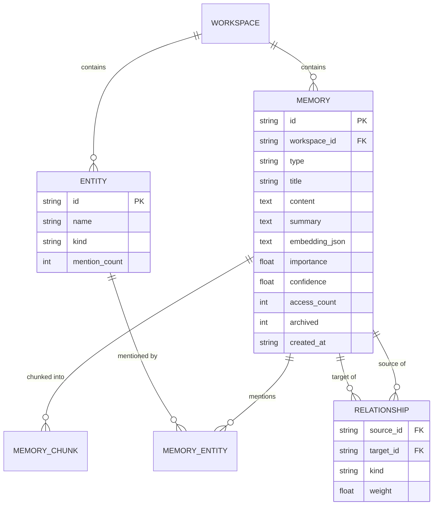

# Engram Architecture

## System overview

```
┌────────────────────────────────────────────────────────────────────┐
│  apps/web (Next.js 15)          sdk/python · sdk/typescript        │
│  dashboard · search · graph     agents call the same REST surface  │
│  timeline · ⌘K palette                                             │
└──────────────┬─────────────────────────────┬───────────────────────┘
               │ REST /v1 (OpenAPI)          │
┌──────────────▼─────────────────────────────▼───────────────────────┐
│  services/api (FastAPI)                                            │
│                                                                    │
│  ┌ Ingestion pipeline ─────────────────────────────────────────┐   │
│  │ clean → chunk → embed → keywords → entities → relationships │   │
│  └──────────────────────────────────────────────────────────────┘  │
│  ┌ Retrieval ───────────────────────────────────────────────────┐  │
│  │ BM25 ┐                                                        │ │
│  │      ├─ RRF fusion ─ weighted re-rank ─ hits / RAG context    │ │
│  │ cos  ┘                                                        │ │
│  └──────────────────────────────────────────────────────────────┘  │
│  auth (API keys) · rate limit · audit log · workspaces             │
└──────────────┬─────────────────────────────────────────────────────┘
               │ SQLAlchemy
     SQLite (default) ── or ── PostgreSQL + pgvector (docker compose)
               │
     AI layer: local (zero-key) | OpenAI | Anthropic | Gemini | Ollama
```

## Memory pipeline

Every write goes through the same stages (`app/pipeline.py`):

1. **Clean** — normalize newlines/whitespace.
2. **Chunk** — paragraph-aware sliding window (900 chars, 120 overlap).
3. **Embed** — one vector per chunk + one document vector, via the configured
   provider. The built-in `local` embedder uses signed feature hashing over
   stemmed uni/bigrams (deterministic, 256-dim, no network).
4. **Keywords** — top-k frequency over non-stopword tokens (surface forms).
5. **Entities** — heuristics: tech lexicon, capitalized spans, emails, URLs.
   Each entity is a first-class graph node, deduplicated per workspace.
6. **Relationship detection** — against existing memories:
   - cosine ≥ 0.92 → `duplicate_of`
   - cosine ≥ 0.55 → `related_to` (weight = similarity)
   - shared entities + semantic overlap → `mentions` (Jaccard-weighted)
7. **Store** — memory, chunks, entity edges, relationships in one transaction.

## Ranking formula

`hybrid_search` (`app/search.py`) fuses two rankers with **Reciprocal Rank
Fusion** (`1/(60+rank)`), then re-ranks:

```
final = 0.42·RRF̂ + 0.16·importance + 0.16·recency + 0.10·frequency
      + 0.10·relationship_degreê + 0.06·confidence
```

- **recency** = `2^(−age_days / half_life)` (half-life 14 d, configurable)
- **frequency** = log-scaled access count (searches touch memories, closing
  the loop: recalled memories rank higher next time)
- **relationship** = normalized weighted degree in the knowledge graph
- every component is returned in the API response (`components`) so UIs can
  explain *why* a memory surfaced

## Knowledge graph

Nodes: memories + entities. Edges: typed memory→memory relationships
(`related_to`, `duplicate_of`, `mentions`, …) and memory→entity mentions.
`GET /v1/workspaces/{id}/graph` returns the JSON; `?center=<id>&hops=n` does
BFS neighborhood expansion. Stored relationally (works on SQLite and
Postgres); the model maps 1:1 onto a property graph if you outgrow SQL.

## Memory compression

`POST /v1/workspaces/{id}/compress` archives stale memories (old + rarely
accessed + low importance): summary is preserved, embeddings and graph edges
stay intact, and archived memories are excluded from search by default.

## ER diagram



## Scaling path

| Concern    | Default (zero-config) | Production            |
| ---------- | --------------------- | --------------------- |
| Storage    | SQLite + WAL          | Postgres + pgvector (HNSW) |
| Embeddings | local hashing         | OpenAI / Gemini / Ollama |
| Rate limit | in-process window     | Redis sliding window  |
| Auth       | open dev mode         | `ENGRAM_API_KEYS`     |
| Vector search | exact cosine in app | pgvector ANN in SQL |
